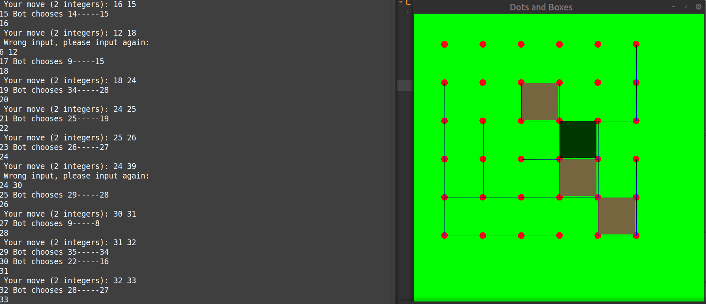

# Dot and Box game

## Install sfml

`sudo apt-get install libsfml-dev`

## To compile the project

` g++ -c *.cpp; g++ main.o Board.o Box.o -o sfml.app -lsfml-graphics -lsfml-window -lsfml-system; `

## To run the app

` ./sfml.app`

